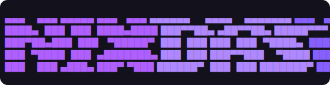

<p align="center">
  
</p>

<h1 align="center">nixdash</h1>

<p align="center">
  <strong>TUI for managing Nix packages</strong><br>
  Search, install, remove, and create temporary shells — all from one interactive interface.
</p>

<p align="center">
  <a href="https://github.com/AThevon/nixdash/releases"></a>
  <a href="https://github.com/AThevon/nixdash/blob/main/LICENSE"></a>
  <a href="https://nixos.org"></a>
</p>

---

## Features

- **Browse** installed packages grouped by type (flakes, nixpkgs, platform-specific)
- **Search** 177k+ nixpkgs with real-time fuzzy search
- **Install / Remove** with diff preview — multiselect batch operations
- **Temporary shells** — test packages before installing
- **External flakes** — guided workflow to add/remove flake inputs
- **Configurable** — works with Home Manager, NixOS, or any Nix flake setup

## Install

```nix
# flake.nix
nixdash = {
  url = "github:AThevon/nixdash";
  inputs.nixpkgs.follows = "nixpkgs";
};
```

```nix
# packages
nixdash.packages.${system}.default
```

```bash
nixdash init
```

## Usage

```bash
nixdash              # Interactive hub
nixdash list         # Browse installed packages
nixdash search       # Search & install
nixdash shell        # Temporary shell
nixdash add-flake    # Add external flake input
nixdash config       # Settings
nixdash init         # Setup wizard
```

## Dependencies

Injected automatically via Nix — no manual setup needed.

[fzf](https://github.com/junegunn/fzf) · [gum](https://github.com/charmbracelet/gum) · [jq](https://github.com/jqlang/jq) · [nix-search-tv](https://github.com/3timeslazy/nix-search-tv)

## License

[MIT](LICENSE)
